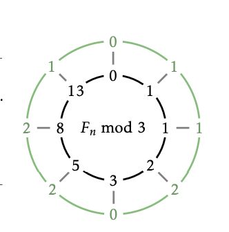

<!--
<p align="center">
  
</p> 
-->


# Competitive contest

## Fibonacci Modulo Problem

### Problem Statement

You are given two integers, **n** and **m**, and you need to find the **nth Fibonacci number modulo m**.

### Approach

The naive approach to find the Fibonacci number at position **n** and then taking the modulo **m** might be inefficient
for large values of **n**. However, you can optimize the solution using the Pisano Period.

### Pisano Period

The Pisano period, also known as the Fibonacci period or cycle, refers to the periodic and repetitive nature of the
remainders when the Fibonacci sequence is divided by a positive integer called the "modulus."

[read more](https://en.wikipedia.org/wiki/Pisano_period)

#### Fibonacci Sequence

The Fibonacci sequence is a series of numbers where each number is the sum of the two preceding ones, usually starting
with 0 and 1.

Example Fibonacci sequence: 0, 1, 1, 2, 3, 5, 8, 13, 21, 34, ...

#### Pisano Period

When the Fibonacci sequence is divided by a modulus (a positive integer), the remainders exhibit a periodic pattern
known as the Pisano period. The length of this period depends on the modulus chosen.

The Pisano period is useful in various applications, especially in problems related to number theory and modular
arithmetic.

#### Formula

Given a modulus 'm,' the Pisano period is denoted as π(m). The period starts with the pair (0, 1) and repeats after a
certain number of terms.

#### Example

For example, if the modulus is 5:
Fibonacci sequence modulo 5

    0, 1, 1, 2, 3, 0, 3, 3, 1, 4,
    0, 4, 4, 3, 2, 0, 2, 2, 4, 1,

    --- Pisano period starts here ---

    0, 1, 1, 2, 3, 0, 3, 3, 1, 4,
    0, 4, 4, 3, 2, 0, 2, 2, 4, 1,
    0, 1, 1, 2, 3, 0, 3, 3, 1, 4

    ... and so on

In this case, the Pisano period (π(5)) is 20, as the sequence starts repeating after 20 terms.

### Code Explanation

Below is the C++ code implementing this approach:

```cpp
#include <iostream>

#define ll long long

ll fib_fast(ll n, ll m) {
    if (n <= 1)
        return n;

    // Pisano period
    ll remainder = 0;

    ll a = 0, b = 1, c;
    for (ll i = 0; i < n - 1; i++) {
        c = (a + b) % m;
        a = b;
        b = c;
        if (a == 0 && b == 1) {
            remainder = i + 1;
            break;
        }
    }

    ll new_n = n % remainder;
    if (new_n <= 1)
        return new_n;

    a = 0, b = 1, c = a + b;
    for (ll i = 0; i < new_n - 1; i++) {
        c = (a + b) % m;
        a = b;
        b = c;
    }

    return c % m;
}

int main() {
    long long n, m;
    std::cin >> n >> m;
    std::cout << fib_fast(n, m) << '\n';
}
```

### Input

The program takes two inputs, **n** and **m**, representing the position of the Fibonacci number and the modulo value.

### Output

The program outputs the **nth Fibonacci number modulo m**.

### Time Complexity

The time complexity of this solution is **O(remainder + new_n)**, where **remainder** is the Pisano Period and **new_n**
is the position of the Fibonacci number within the Pisano Period. This is a significant optimization over the naive
approach.
